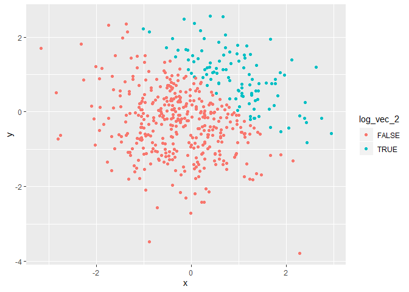
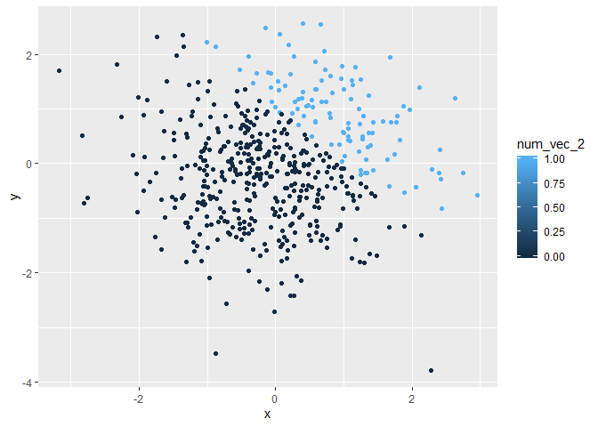
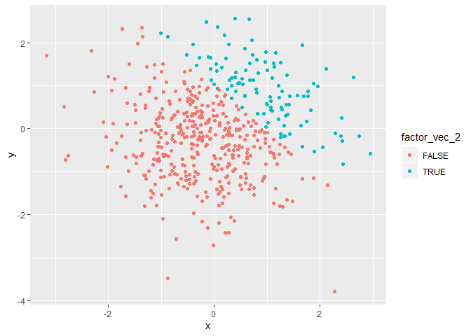

p8105\_hw1\_scl2160
================
Sam Loewen
9/18/2019

## Problem 1

First I am creating a dataframe that meets these requirements:

  - a random sample of size 8 from a standard Normal distribution
  - a logical vector indicating whether elements of the sample are
    greater than 0
  - a character vector of length 8
  - a factor vector of length 8, with 3 different factor
    “levels”

<!-- end list -->

``` r
library(tidyverse)
```

    ## -- Attaching packages ---------------------------------------------------------------------------------- tidyverse 1.2.1 --

    ## v ggplot2 3.2.1     v purrr   0.3.2
    ## v tibble  2.1.3     v dplyr   0.8.3
    ## v tidyr   0.8.3     v stringr 1.4.0
    ## v readr   1.3.1     v forcats 0.4.0

    ## -- Conflicts ------------------------------------------------------------------------------------- tidyverse_conflicts() --
    ## x dplyr::filter() masks stats::filter()
    ## x dplyr::lag()    masks stats::lag()

``` r
set.seed(3471)
df_p1 = tibble(
  norm_samp = rnorm(8),
  log_vec = norm_samp > 0,
  char_vec = c("dog","cat", "puppy", "kitten", "eggs", "sandwich", "beer", "pencil"),
  factor_vec = factor(c("pug","lab","chow","chow","lab","chow","pug","lab"))
)
```

When I take the mean of each variable in my dataframe I can only get the
mean of ‘norm\_samp’ and ‘log\_vec’, as they are the only numeric
variables.

``` r
mean(pull(df_p1, norm_samp))
```

    ## [1] -0.5451522

``` r
mean(pull(df_p1, log_vec))
```

    ## [1] 0.5

``` r
mean(pull(df_p1, char_vec))
```

    ## Warning in mean.default(pull(df_p1, char_vec)): argument is not numeric or
    ## logical: returning NA

    ## [1] NA

``` r
mean(pull(df_p1, factor_vec))
```

    ## Warning in mean.default(pull(df_p1, factor_vec)): argument is not numeric
    ## or logical: returning NA

    ## [1] NA

Next I will write a code chunk that applies the as.numeric function to
the logical, character, and factor variables.

``` r
echo = FALSE
as.numeric(pull(df_p1,log_vec))
```

    ## [1] 1 1 0 0 0 1 1 0

``` r
as.numeric(pull(df_p1,char_vec))
```

    ## Warning: NAs introduced by coercion

    ## [1] NA NA NA NA NA NA NA NA

``` r
as.numeric(pull(df_p1,factor_vec))
```

    ## [1] 3 2 1 1 2 1 3 2

My logic vector and factor vector were able to be converted to numeric,
but my character variable was not.

I will now:

  - convert the logical vector to numeric, and multiply the random
    sample by the result
  - convert the logical vector to a factor, and multiply the random
    sample by the result
  - convert the logical vector to a factor and then convert the result
    to numeric, and multiply the random sample by the
    result

<!-- end list -->

``` r
as.numeric(pull(df_p1, log_vec))*(pull(df_p1, norm_samp))
```

    ## [1] 0.78105449 0.05758116 0.00000000 0.00000000 0.00000000 0.22497457
    ## [7] 0.32333665 0.00000000

``` r
as.factor(pull(df_p1, log_vec))*(pull(df_p1, norm_samp))
```

    ## Warning in Ops.factor(as.factor(pull(df_p1, log_vec)), (pull(df_p1,
    ## norm_samp))): '*' not meaningful for factors

    ## [1] NA NA NA NA NA NA NA NA

``` r
as.numeric((as.factor(pull(df_p1, log_vec))))*(pull(df_p1, norm_samp))
```

    ## [1]  1.5621090  0.1151623 -1.2230809 -0.1648594 -1.9636323  0.4499491
    ## [7]  0.6466733 -2.3965918

## Problem 2

First I will create a data frame comprised of:

  - x: a random sample of size 500 from a standard Normal distribution
  - y: a random sample of size 500 from a standard Normal distribution
  - A logical vector indicating whether x + y \> 1
  - A numeric vector created by coercing the above logical vector
  - A factor vector created by coercing the above logical vector

<!-- end list -->

``` r
library(tidyverse)
set.seed(2345)
df_p2 = tibble(
  x = rnorm(500),
  y = rnorm(500),
  log_vec_2 = x + y > 1,
  num_vec_2 = as.numeric(log_vec_2),
  factor_vec_2 = as.numeric(log_vec_2)
)
```

My data set has 500 rows and 5 columns. The mean of variable x is
-0.02736, the median is -0.0534419, and the standard deviation is
0.9758219. The proportion of cases for which x + Y \> 1 is 0.216.

Next I will make a scatterplot of y vs x that color points using the
logical, numeric, and factor
variables.

``` r
ggplot(df_p2, aes(x=x, y=y, color = log_vec_2)) + geom_point()
```

<!-- -->

``` r
ggsave("scatter_plot.pdf", height = 4, width = 6)
ggplot(df_p2, aes(x=x, y=y, color = num_vec_2)) + geom_point()
```

<!-- -->

``` r
ggplot(df_p2, aes(x=x, y=y, color = factor_vec_2)) + geom_point()
```

<!-- -->

In the second and third plots the scale of our points is 0-1. Both
appear to be highly segmented between 0s and 1s.
